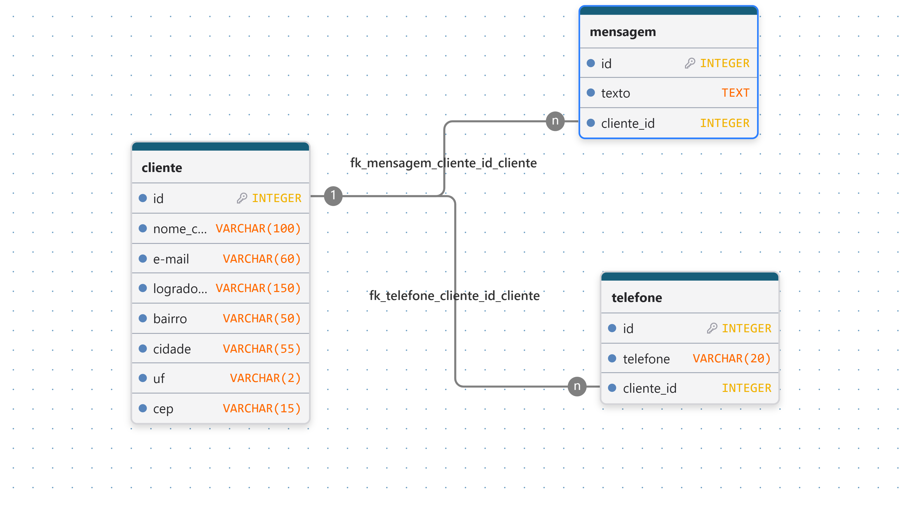

# projeto de banco de dados
**Nome do projeto**: Site da confeitaria sempre doce
**Equipe de Desenvolvimento**: Manoel
## 1. Visão geral do sistema(Escopo) 
A **Confeitaria Sempre Doce** deseja expandir sua atuação criando um site para vender seus produtos, estes são feitos com muito amor e carinho mantendo a tradição da sua familia.
## 2. Regras de Negócio 
**RN01**: O sistema deve gerenciar o cadastro de seus clientes, as informações úteis que foram levantadas são:

 - Nome Completo
 - Telefone
 - E-mail
 - Endereço (logradrouro, bairro, estado, cep, cidade)

**RF02**: O sistema deve permitir que o cliente envie uma mensagem com as informações do seu pedido, a mensagem sera enviada via formulário do sistema preenchendo os seguintes campos:

 - Nome
 - E-mail
 - Telefone
 - Endereço
 - Texto da mensagem

 ## Modelagem conceitual
 

 ## Modelo logico
 

  
